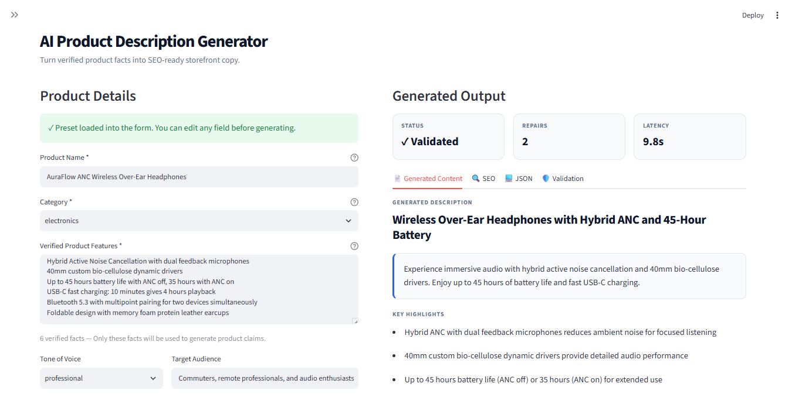
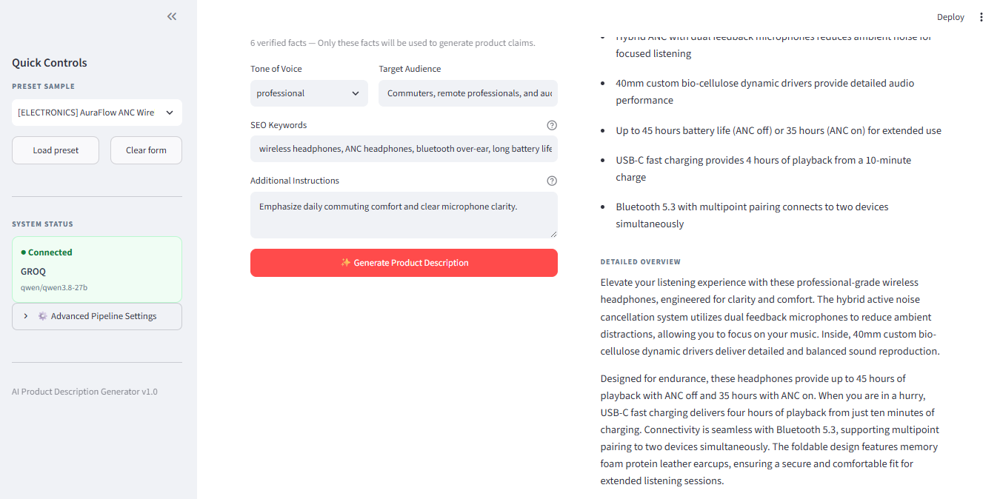

# AI-Powered eCommerce Product Description Generator

> Generate grounded, SEO-optimized eCommerce product copy from verified product facts using LLMs, structured outputs, deterministic validation, and bounded repair.

[](https://www.python.org/)
[](https://www.langchain.com/)
[](https://docs.pydantic.dev/)
[](https://streamlit.io/)
[](https://groq.com/)

---

## Overview

The **AI-Powered eCommerce Product Description Generator** is a controlled GenAI application that converts structured product information into production-ready storefront content.

Instead of asking an LLM to freely write marketing copy, the application follows a controlled pipeline:

```text
Verified Product Facts
        │
        ▼
   Pydantic Input
    Validation
        │
        ▼
Category-Aware Prompt
   Composition
        │
        ▼
     LLM Generation
        │
        ▼
Structured JSON Output
        │
        ▼
Deterministic Validation
        │
   ┌────┴────┐
   │         │
 Valid     Invalid
   │         │
   │      Bounded Repair
   │       Attempts
   │         │
   └────┬────┘
        ▼
Validated Product Copy
        │
   ┌────┼──────────────┐
   ▼    ▼              ▼
Streamlit  CLI   Storefront Payloads
```

The primary design goal is **controlled generation rather than unrestricted text generation**.

---

# ✨ Features

## 1. Category-Aware Generation

The generator supports:

* Electronics
* Apparel
* Home Goods

Each category has its own external JSON prompt configuration containing:

* Category-specific writing rules
* Feature-to-benefit guidance
* Forbidden claims
* Domain-specific constraints

This keeps business rules separate from Python code.

---

## 2. Multiple Writing Tones

The application supports six tone profiles:

* Professional
* Casual
* Persuasive
* Minimal
* Luxury
* Technical

The same product facts can therefore produce different storefront styles without changing the underlying generation pipeline.

---

## 3. Grounded / Closed-World Generation

The system is designed to keep generated content grounded in the facts supplied by the user.

The model is instructed not to invent:

* Specifications
* Certifications
* Warranties
* Compatibility
* Performance guarantees
* Unsupported product claims

For example, a product feature such as:

```text
Bluetooth 5.3
```

can be transformed into a reasonable benefit such as:

```text
Modern wireless connectivity
```

but should not become an unsupported claim such as:

```text
The fastest Bluetooth connection available.
```

---

## 4. Deterministic Validation

LLM output is validated programmatically after generation.

The validation layer checks:

* Meta title length
* Meta description length
* Number of bullet points
* SEO keyword coverage
* Forbidden claims
* Output structure
* Schema validity

Default SEO constraints include:

| Field            |        Requirement |
| ---------------- | -----------------: |
| Meta title       |   30–60 characters |
| Meta description | 120–160 characters |
| Bullet points    |                3–6 |
| Keyword coverage |       Configurable |

This prevents the application from relying entirely on prompt instructions for exact constraints.

---

## 5. Bounded Repair Loop

If generated content fails validation, the application can send a targeted repair request to the LLM.

The repair process is intentionally bounded.

```text
Generate
   │
   ▼
Validate
   │
   ├── PASS ──► Return result
   │
   └── FAIL
          │
          ▼
    Repair Prompt
          │
          ▼
       Generate
          │
          ▼
       Validate
```

The number of repair attempts is controlled by the application configuration.

This avoids uncontrolled agentic loops, excessive API usage, and unpredictable execution time.

---

# 🖥️ Streamlit Dashboard

The project includes an interactive Streamlit dashboard.





The dashboard provides:

* Product input form
* Category selection
* Tone selection
* Verified feature input
* Target audience
* SEO keywords
* Additional instructions
* Preset product samples
* Generation status
* Latency metrics
* Retry/repair information
* Generated product copy
* SEO metadata
* Structured JSON output
* Validation results
* Shopify export
* WooCommerce export

Run it with:

```bash
streamlit run dashboard/streamlit_app.py
```

---

# 🧩 Generated Output

The generator produces structured product information including:

### Storefront Content

* Product title
* Short description
* Long description
* Feature bullets

### SEO

* Meta title
* Meta description
* Keywords used

### Validation

* Validation status
* Errors
* Warnings
* Keyword coverage
* Retry count
* Generation latency

---

# 🛒 eCommerce Integrations

The project includes payload converters for:

## Shopify

The application can convert generated content into a Shopify-compatible product payload containing:

* Product title
* HTML product description
* Product type
* Tags
* SEO title
* SEO description
* AI generation metadata

The generated Shopify payload is configured as a draft rather than automatically publishing a product.

## WooCommerce

The application can also generate a WooCommerce REST API-compatible payload containing:

* Product name
* Short description
* Full description
* Categories
* Tags
* Yoast SEO metadata
* Generation metadata

These adapters generate payloads only; they do not require live storefront credentials. 

---

# 🏗️ Architecture

```text
                         ┌──────────────────────┐
                         │ Streamlit Dashboard  │
                         └──────────┬───────────┘
                                    │
                         ┌──────────▼───────────┐
                         │    ProductInput      │
                         │    Pydantic Model    │
                         └──────────┬───────────┘
                                    │
                         ┌──────────▼───────────┐
                         │  ProductGenerator    │
                         │                      │
                         │ Prompt Composition   │
                         │ Category Rules       │
                         │ Tone Rules           │
                         │ SEO Instructions     │
                         │ LLM Invocation       │
                         └──────────┬───────────┘
                                    │
                         ┌──────────▼───────────┐
                         │ Structured JSON      │
                         │ Output Parsing       │
                         └──────────┬───────────┘
                                    │
                         ┌──────────▼───────────┐
                         │ Deterministic        │
                         │ Validator            │
                         └──────────┬───────────┘
                                    │
                         ┌──────────▼───────────┐
                         │ Validation Result    │
                         └──────────┬───────────┘
                                    │
                     ┌──────────────┴──────────────┐
                     │                             │
                   PASS                          FAIL
                     │                             │
                     │                      Bounded Repair
                     │                             │
                     └──────────────┬──────────────┘
                                    │
                         ┌──────────▼───────────┐
                         │ Final Product Result │
                         └───────┬─────┬────────┘
                                 │     │
                    ┌────────────┘     └─────────────┐
                    ▼                                ▼
              Streamlit UI                    Platform Adapters
                                              Shopify / WooCommerce
```

---

# 📁 Project Structure

```text
Product-Description-Generator/
│
├── app/
│   ├── __init__.py
│   ├── config.py
│   ├── models.py
│   ├── generator.py
│   └── validator.py
│
├── prompts/
│   ├── electronics.json
│   ├── apparel.json
│   └── home_goods.json
│
├── data/
│   ├── samples.json
│   └── screeshots/
│       ├── sc1.png
│       └── sc2.png
│
├── dashboard/
│   ├── __init__.py
│   └── streamlit_app.py
│
├── tests/
│   ├── __init__.py
│   └── test_generator.py
│
├── integrations.py
├── evaluation.py
├── main.py
├── requirements.txt
├── .env.example
├── .gitignore
└── README.md
```

---

# ⚙️ Technology Stack

| Technology               | Purpose                   |
| ------------------------ | ------------------------- |
| Python 3.11+             | Application runtime       |
| Streamlit                | Web interface             |
| LangChain                | LLM orchestration         |
| Groq                     | LLM inference             |
| OpenAI-compatible models | Optional LLM provider     |
| Pydantic v2              | Input/output contracts    |
| python-dotenv            | Environment configuration |
| Pytest                   | Automated testing         |

The project dependencies are defined in `requirements.txt`. 

---

# 🚀 Installation

## 1. Clone the Repository

```bash
git clone https://github.com/Vedant04-tech/Product-Description-Generator.git
cd Product-Description-Generator
```

---

## 2. Create a Virtual Environment

### Windows PowerShell

```powershell
python -m venv .venv
.\.venv\Scripts\Activate.ps1
```

### macOS / Linux

```bash
python3 -m venv .venv
source .venv/bin/activate
```

---

## 3. Install Dependencies

```bash
pip install -r requirements.txt
```

---

# 🔐 Environment Configuration

Create a `.env` file from the provided example:

```bash
cp .env.example .env
```

On Windows PowerShell:

```powershell
Copy-Item .env.example .env
```

Configure your Groq credentials:

```env
GROQ_API_KEY=gsk_your_api_key_here

GROQ_MODEL=qwen/qwen3.8-27b
GROQ_TEMPERATURE=0.4
GROQ_MAX_TOKENS=1200

MAX_RETRIES=2

META_TITLE_MIN_LEN=30
META_TITLE_MAX_LEN=60

META_DESC_MIN_LEN=120
META_DESC_MAX_LEN=160

BULLET_MIN_COUNT=3
BULLET_MAX_COUNT=6
```

Do **not** commit `.env` or API keys to GitHub.

---

# ▶️ Running the Application

## Streamlit Dashboard

```bash
streamlit run dashboard/streamlit_app.py
```

The application will open in your browser.

Typical workflow:

```text
1. Enter product information
2. Select category
3. Enter verified product features
4. Select tone
5. Add SEO keywords
6. Generate description
7. Review validation
8. Export storefront payload
```

---

# 💻 Command-Line Interface

The project also provides a CLI.

## Interactive Mode

```bash
python main.py --interactive
```

The interactive CLI supports:

* Sample product loading
* Custom product input
* Category selection
* Tone selection
* SEO keywords
* Additional notes

---

## Direct Generation

Example:

```bash
python main.py \
  --name "NovaCharge 65W GaN Dual-Port Wall Charger" \
  --category electronics \
  --features \
    "Gallium Nitride semiconductor" \
    "Dual ports 65W USB-C and 18W USB-A" \
    "Foldable wall prongs" \
  --tone minimal \
  --keywords \
    "GaN charger" \
    "fast wall charger"
```

The CLI also supports exporting Shopify and WooCommerce payloads.

Example:

```bash
python main.py \
  --name "NovaCharge 65W GaN Dual-Port Wall Charger" \
  --category electronics \
  --features "Gallium Nitride semiconductor" "Dual ports 65W USB-C and 18W USB-A" "Foldable wall prongs" \
  --tone minimal \
  --keywords "GaN charger" "fast wall charger" \
  --export-shopify shopify_product.json \
  --export-woo woo_product.json
```

The CLI implementation supports both interactive and direct argument workflows. 

---

# 🧪 Testing

Run the test suite with:

```bash
pytest tests/ -v
```

The tests cover areas including:

* Pydantic input validation
* Product schema validation
* Category prompt loading
* Prompt composition
* SEO validation
* Bullet count validation
* Forbidden claims
* Keyword coverage
* Retry/repair behavior
* Integration payload generation

The test suite is designed to run without requiring a live LLM API.

---

# 📊 Evaluation & Benchmarking

The repository includes an evaluation framework in:

```text
evaluation.py
```

It measures:

* Generation success rate
* Schema validity
* Validation pass rate
* SEO compliance
* Keyword coverage
* Retry count
* Average latency
* Median latency
* Human-effort reduction

Run a benchmark:

```bash
python evaluation.py --samples 10
```

Run the prompt comparison:

```bash
python evaluation.py --compare --samples 10
```

Run an offline benchmark:

```bash
python evaluation.py --mock --samples 10
```

Save results:

```bash
python evaluation.py \
  --samples 15 \
  --output evaluation_report.json
```

The evaluation framework includes mock LLM modes for reproducible offline testing. 

---

# 🔬 Prompt Evolution

The project evaluates three conceptual prompt versions:

| Version | Approach                             | Main Limitation                              |
| ------- | ------------------------------------ | -------------------------------------------- |
| V1      | Naive prompt                         | Unstructured output                          |
| V2      | Structured JSON                      | Does not reliably satisfy strict constraints |
| V3      | Category-aware + validation + repair | Controlled production pipeline               |

### V1 — Naive

The LLM receives a basic marketing-writing instruction.

```text
Product Facts
     ↓
LLM
     ↓
Free-form Text
```

Problem:

* No guaranteed schema
* No deterministic SEO constraints
* Greater risk of unsupported claims

---

### V2 — Structured

The LLM is instructed to produce JSON.

```text
Product Facts
     ↓
Structured Prompt
     ↓
JSON
     ↓
Validation
```

This improves machine-readability but still cannot guarantee exact character limits or other deterministic constraints.

---

### V3 — Controlled Pipeline

The production approach adds:

* Category-specific rules
* Structured output
* Deterministic validation
* Keyword checking
* Forbidden claim detection
* Bounded repair

```text
Facts
 ↓
Category Prompt
 ↓
LLM
 ↓
JSON
 ↓
Validator
 ↓
Repair if necessary
 ↓
Validated Output
```

---

# 🛡️ Hallucination Control Strategy

The system uses several layers of protection.

### 1. Closed-World Prompting

The LLM is instructed to generate content only from supplied product facts.

### 2. Conservative Feature-to-Benefit Mapping

Features may be translated into reasonable customer benefits, but unsupported specifications and claims are prohibited.

### 3. Deterministic Validation

The validator checks generated content after the LLM responds.

### 4. Forbidden Claims

Category prompt files can define claims that should not appear in generated copy.

### 5. Bounded Repair

Failed outputs are repaired only a limited number of times.

This makes the generation pipeline more predictable than an unconstrained LLM call.

---

# 🧠 Why LangChain?

LangChain is used primarily as an orchestration layer.

The project uses it for:

* Chat model abstraction
* Structured message composition
* Provider abstraction
* Prompt/message management

The application intentionally avoids complex autonomous agents.

The goal is:

```text
Deterministic pipeline
        >
Autonomous agent behavior
```

for this particular use case.

---

# 🧾 Why Pydantic?

Pydantic provides explicit contracts for the application.

For example:

```text
ProductInput
    │
    ├── product_name
    ├── category
    ├── features
    ├── target_audience
    ├── tone
    ├── seo_keywords
    └── additional_notes
```

This prevents invalid input from entering the generation pipeline.

The generated product description is also represented through structured models.

---

# 🔍 Why Deterministic Validation?

LLMs are probabilistic.

Even when a prompt says:

```text
Meta description must contain 120–160 characters.
```

the model may return:

```text
118 characters
```

or:

```text
171 characters
```

Therefore, exact constraints are enforced in Python rather than trusting the model alone.

This follows a simple principle:

> **Use the LLM for language generation and Python for deterministic rules.**

---

# 🚫 Why No RAG or Vector Database?

This application does not require RAG for its core workflow.

The product facts are already supplied directly by the user:

```text
Product
Features
Audience
Tone
SEO Keywords
Additional Instructions
```

There is therefore no need to retrieve external documents to establish product facts.

Adding a vector database would introduce:

* More infrastructure
* Additional latency
* More operational complexity
* Additional failure modes

without providing significant value for the MVP.

---

# 📈 Production Scaling Ideas

Potential future improvements include:

### Bulk SKU Generation

Support CSV or spreadsheet uploads:

```text
CSV
 ↓
Validation
 ↓
Parallel Generation
 ↓
Validation
 ↓
Export
```

### Async Processing

Use:

* Celery
* Redis
* Background workers

for thousands of SKUs.

### Semantic Caching

Cache frequently generated feature-to-benefit transformations to reduce LLM calls.

### Rate Limiting

Control API usage per:

* User
* Store
* API key
* Batch

### Model Routing

Use smaller/cheaper models for simple products and larger models for more complex copywriting tasks.

### Observability

Track:

* Generation latency
* Validation failure rate
* Repair rate
* Token usage
* Keyword coverage
* Model errors

Potential tools include:

* OpenTelemetry
* Prometheus
* Grafana

---

# 🔒 Security Notes

Never commit credentials to the repository.

Do not place API keys directly in:

```text
main.py
generator.py
dashboard/
prompts/
```

Use environment variables instead:

```env
GROQ_API_KEY=...
```

The `.env` file should remain local and should be included in `.gitignore`.

---

# ⚠️ Current Limitations

This project is designed as an MVP / portfolio-grade GenAI application.

Current limitations include:

* Generation depends on the configured LLM provider.
* SEO validation is rule-based rather than search-engine based.
* Product factual accuracy depends on the quality of supplied source facts.
* Storefront integrations currently generate API payloads rather than directly publishing products.
* Large-scale batch processing is not yet implemented.
* Human review is still recommended before publishing generated copy.

---

# 🎯 Example Use Cases

### eCommerce Product Teams

Generate initial storefront copy for new SKUs.

### Marketplace Sellers

Create structured product descriptions from verified specifications.

### Marketing Teams

Generate different copy styles for the same product.

### SEO Teams

Generate metadata and monitor keyword coverage.

### Product Catalog Operations

Process large numbers of product records using the same validation rules.

---

# 📌 Design Principles

The project follows five major principles:

### 1. Ground the model

Only provide verified facts to the generation layer.

### 2. Structure the output

Use schemas instead of relying on free-form text.

### 3. Validate outside the LLM

Use deterministic Python checks for exact requirements.

### 4. Repair within limits

Never allow uncontrolled generation loops.

### 5. Keep business rules configurable

Store category-specific rules in JSON rather than hard-coding everything into Python.

---

# 👨‍💻 Project Goals

This project demonstrates practical application of:

* Generative AI
* LLM orchestration
* Prompt engineering
* Structured generation
* Pydantic validation
* Deterministic output validation
* Retry/repair strategies
* Streamlit application development
* eCommerce integrations
* Offline testing
* Prompt evaluation
* AI reliability engineering

The emphasis is not simply on generating text, but on building a **controlled and testable GenAI pipeline**.

---

# 📜 License

```text
MIT License
```

---

# ⭐ Future Roadmap

* [ ] CSV bulk product generation
* [ ] Batch generation dashboard
* [ ] Direct Shopify publishing
* [ ] Direct WooCommerce publishing
* [ ] OpenAI model configuration UI
* [ ] Generation history
* [ ] User authentication
* [ ] Cost/token tracking
* [ ] Advanced SEO scoring
* [ ] A/B copy generation
* [ ] Human approval workflow
* [ ] Production observability
* [ ] Async job processing

---

## Author

**Vedant04-tech**

Built as a practical demonstration of controlled, production-oriented GenAI application design for eCommerce content generation.
